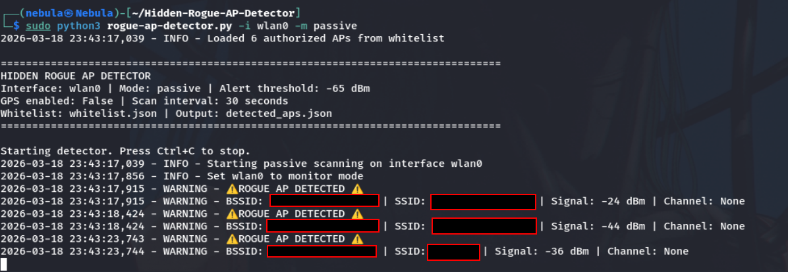

# Hidden Rogue AP Detector

A Python-based tool for detecting rogue/unauthorized wireless access points on a network using RSSI signal strength analysis.


## Features

- **Rogue AP Detection**: Identifies unauthorized access points using a whitelist approach
- **Signal Strength Analysis**: Uses RSSI measurements to estimate AP location
- **Multiple Scanning Modes**:
  - Active scanning using `iwlist`
  - Passive scanning using packet sniffing with `scapy`
- **Alerting System**: Warns when new APs are detected with strong signal
- **GPS Integration**: Optional tracking of physical locations when detecting APs
- **Comprehensive Logging**: Detailed records of all detected networks

## Screenshots

### Passive Scanning - Rogue AP Detection



## Requirements

- Python 3.x
- `scapy` package
- `wireless-tools` package (for `iwlist`)
- `gpsd-py3` (optional, for GPS integration)
- Root privileges (required for monitor mode)

## Installation

Clone this repository:

```bash
git clone https://github.com/Rootless-Ghost/Hidden-Rogue-AP-Detector.git
cd Hidden-Rogue-AP-Detector
```

Install the required Python packages:

```bash
pip install scapy
pip install gpsd-py3  # Optional, for GPS support
```

Install the wireless tools package:

```bash
# Debian/Ubuntu/Kali
sudo apt-get install wireless-tools

# CentOS/RHEL
sudo yum install wireless-tools
```

## Usage

The script must be run with root privileges to enable monitor mode:

```bash
sudo python rogue_ap_detector.py [options]
```

### Command Line Options

| Option | Description |
|--------|-------------|
| `-i, --interface` | Wireless interface to use (default: wlan0) |
| `-m, --mode` | Scanning mode: `active` (iwlist) or `passive` (scapy) |
| `-t, --threshold` | RSSI threshold for alerts in dBm (default: -65) |
| `-s, --scan-interval` | Interval between scans in seconds (default: 30) |
| `-g, --gps` | Enable GPS integration if available |
| `-w, --whitelist` | Path to whitelist file (default: whitelist.json) |
| `-o, --output` | Output file for results (default: detected_aps.json) |

### Examples

Basic usage with default settings:

```bash
sudo python rogue_ap_detector.py
```

Using a specific interface with passive scanning:

```bash
sudo python rogue_ap_detector.py -i wlan1 -m passive
```

Enable GPS integration with a custom whitelist:

```bash
sudo python rogue_ap_detector.py -g -w my_whitelist.json
```

## Whitelist Management

The whitelist is a JSON file containing MAC addresses of authorized access points:

```json
{
    "authorized_aps": [
        "00:11:22:33:44:55",
        "AA:BB:CC:DD:EE:FF"
    ]
}
```

You can manually edit this file, or use the script's API to manage the whitelist programmatically.

## How it Works

1. **Scanning**: The tool scans for wireless networks using either active scanning via `iwlist` commands or passive scanning by capturing beacon frames with `scapy` (requires monitor mode).
2. **Detection**: Each detected AP is compared against the whitelist. Unrecognized APs are flagged as potential rogues.
3. **Analysis**: Signal strength measurements (RSSI) are used to approximate the physical location of the detected APs.
4. **Alerting**: When a rogue AP with strong signal is detected, an alert is triggered.

## Security Considerations

- Only use this tool on networks you own or have explicit permission to test
- Putting wireless interfaces in monitor mode can affect normal network connectivity
- Maintain your whitelist regularly to avoid false positives

## License

This project is licensed under the MIT License - see the [LICENSE](LICENSE) file for details.

## Acknowledgments

- The [scapy](https://scapy.net/) project for packet manipulation capabilities
- The wireless tools package for network scanning functionality
